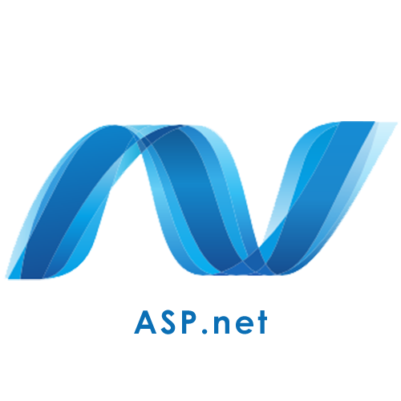
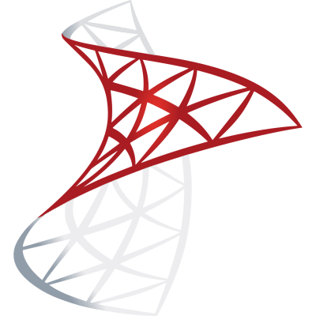

<h1 align="center">
  
</h1>

 

  - 📚 I'm a master degree student at Computer Engineering department in Gebze Technical University. My bachelor degrees are Electrical-Electronics Engineering(3.21 GPA / 4) and Computer Engineering(Double Major - 3.58 GPA / 4) at Pamukkale University. Also completed one year Erasmus Studentship(8.47 GPA /10) at Computer Science department in Rezekne Technologies Academy - Latvia.
   
  - 👀 I’m interested in Back-End Development as well as AI Engineering.
   
  - 📍 Kocaeli, Turkey
   
   
  - 🌱 To dive into about myself, I’m currently learning Django, Pyqt5 and some AI tools of Pytorch, Tensorflow for my thesis.
   I love to work with Back-End technologies with soluting some hard problems and thinking what's going on behind, so you'll find more projects about back-end technologies when you look at my profile. Please don't be hesitate to ask me a question about them. I'm going to also be glad for that😠

<h2 align="center">🔥 Languages & Tools 🔥</h2>
<h3 align ="center">The Programming Languages that I use</h3>

 
 
 

 
 
 
 

<h3 align ="center">The Back-End Technologies</h3>

 
 

<h3 align ="center">The Front-End Technologies</h3>

 
 
 

<h3 align ="center">The Databases</h3>

 
 

<h3 align ="center">The Auxiliary Tools</h3>

 
 
 
 
 
 
 
 
 

   

&nbsp;
  

<h2 align="center">🤗 You can reach out 🤗 </h2>

Feel free to contact me about my specializations that I claim on my social career accounts. I will do my best to help you 😊 

<h2 align="center">🔗 Contact me 🔗</h2>

